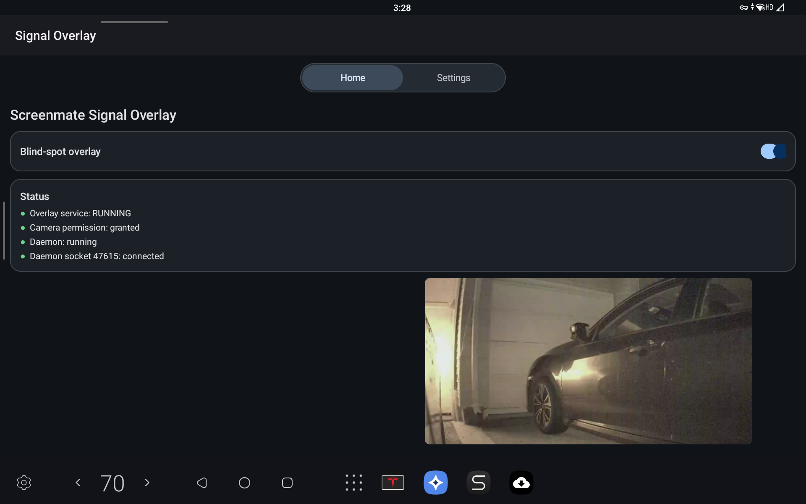
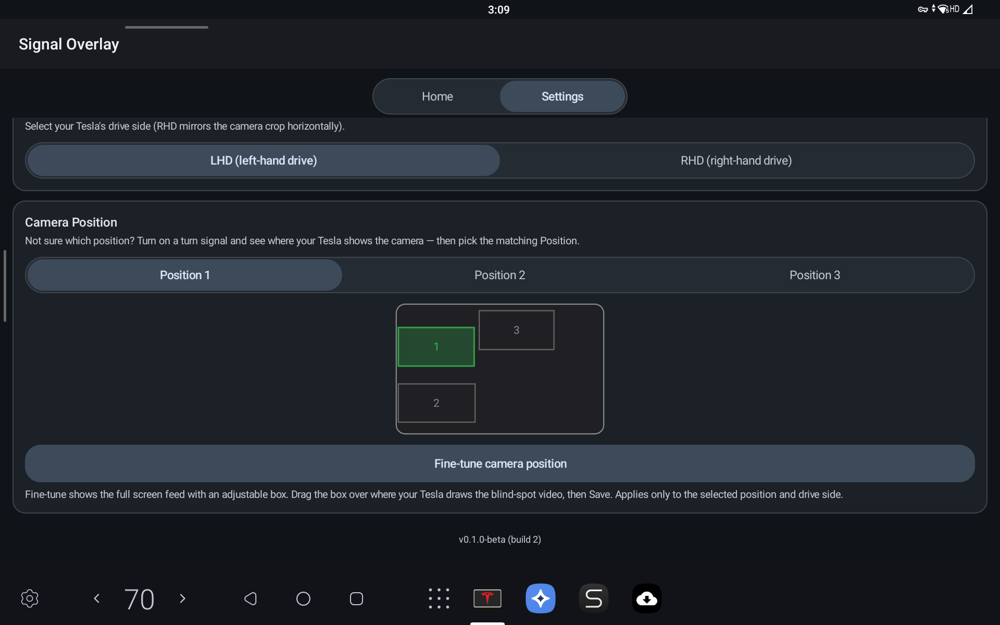

# Screenmate Signal Overlay — Blind-Spot Camera (Beta)

Float your Tesla's **blind-spot / turn-signal camera** as a small window on top of **any app** on your Teslogic **Screenmate**, the moment you flick a turn signal — then it disappears when you cancel it.

No more missing your blind-spot view just because you're on the map, music, or another app instead of the Tesla Interface.

> **Beta.** Works today on left-hand-drive Teslas with the blind-spot camera enabled (right-hand drive is auto-mirrored + fine-tunable). See [Camera Position](#camera-position) and [Known limits](#known-limits).

---

## What it does

- When you turn on a signal **and you're not in the Tesla Interface**, the app opens the Tesla camera feed, crops it to your blind-spot box, and floats it over whatever you're using.
- When you cancel the signal, it goes away.
- When you're **inside the Tesla Interface**, it stays out of the way — you already see the camera there.
- **Draggable** — put the window wherever you like.

Everything runs **on your device**. Nothing is uploaded, streamed, or sent anywhere.

---

## Requirements

- Teslogic **Screenmate** (Android 14) with its built-in local root adb (default on Screenmate).
- A Tesla with the blind-spot / turn-signal camera enabled on the vehicle screen.

## Install

1. **Enable Developer options** — on the Screenmate: **Settings → About → tap "Build number" 7 times**, then in **Developer options** turn on **USB debugging**.
2. **Install the APK** — download the latest from [Releases](../../releases) and install it.
3. **Open the app.**
4. **Tap the "Allow USB debugging?" dialog** — the first time you open it, this popup appears. **Check the "Always allow from this computer" box, then tap Allow.**
   - The checkbox matters: it makes it permanent so it never asks again. Without it, you'd get re-prompted.
   - This is how the app starts its own background helper (the daemon) **without needing a PC**. You only do this **once, ever.**
   - *If the dialog is slow to appear, leave the app open a few seconds — it retries on its own.*
5. **That's it.** After that one tap the app **automatically grants itself** the two permissions it needs — **Draw over other apps** and **Camera** — and starts its daemon. The Home screen should show **Daemon: running** and **Camera: granted** in green. (If a Camera or Draw-over-apps prompt ever appears, just allow it.)
6. **Pick your camera position** (below), flick a turn signal, and you're set.

## Drive side & camera position

**Drive side** — pick **LHD** or **RHD**. Right-hand-drive mirrors the crop to the opposite side automatically.

**Camera position** — Tesla places the blind-spot camera in one of **three spots** on the vehicle screen. Choose **Position 1, 2, or 3** to match yours (the in-app mini-map shows where each one sits):

- **Position 1** — top-left
- **Position 2** — bottom-left
- **Position 3** — top-right (over the map)

**Not sure which?** Turn on a turn signal and see where your Tesla shows the camera — then pick the matching Position.

## Using it with a split screen

The overlay stands down whenever the **Tesla Interface** itself is on screen (you already see the camera there). In a split with the Tesla Interface, pick the camera **Position that lands in the Tesla Interface's half**:

- Tesla Interface on the **right** → use **Position 3** (top-right)
- Tesla Interface on the **left** → use **Position 1 or 2** (left side)

When you're fully in **another app** (not the Tesla Interface), *any* position works — the overlay floats the cropped camera for you.

## Known limits

- **Left-hand drive (LHD) is the only drive side tested on a real car.** **RHD is auto-mirrored** from the calibrated LHD presets and should be close, but **it has not been verified on an actual right-hand-drive Tesla** — RHD users should expect to use **Fine-tune** to dial it in. Fine-tune (drag/resize your own box) makes any drive side, position, or custom setup exact, and saves per position.
- **After a reboot — turn on the app's Auto-start.** Android 14 blocks a camera app from starting its video from a cold boot in the background. The fix: enable **Auto-start** for this app (long-press the app icon, or your Screenmate's startup/autostart manager). With it on, the app relaunches itself on boot, re-arms the camera, and everything comes back with **no manual step**. (Without Auto-start, just open the app once after each reboot to re-arm it.)
- Beta software — expect rough edges.

---

## Privacy

The camera feed is read and displayed **locally on your Screenmate only**. The app has no analytics, no accounts, and sends nothing off the device. The overlay only appears while a signal is active.

## Safety

This is a **convenience overlay, not a safety system.** It can lag, freeze, or fail to appear. **Always check your mirrors and surroundings yourself.** Use at your own risk. The author is not responsible for any damage, injury, or loss.

---

## License

**PolyForm Strict License 1.0.0** — see [LICENSE.md](LICENSE.md).
Personal / noncommercial use only. **No commercial use, no redistribution, no modification.** The source is not published; the APK is provided as-is.

© chufleco
